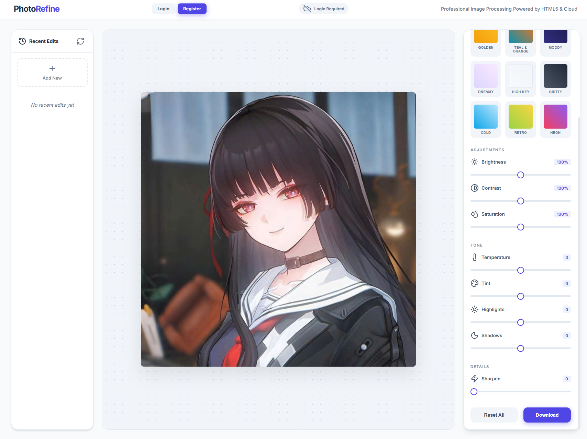

# PhotoRefine 📸

PhotoRefine is a professional-grade, browser-based image editor built with modern web technologies. It provides a sleek, high-performance interface for quick photo adjustments, professional presets, and persistent edit history using IndexedDB.

 

## ✨ Features

- **Professional UI/UX**: Minimalist 3-column layout with Lucide icons and Inter typography.
- **15 Professional Presets**:
  - **Core**: Bold (High dynamic range), Vivid, Vintage, B&W.
  - **Cinematic**: Cinematic tones, Teal & Orange, Moody, Gritty.
  - **Nature**: Golden Hour, Cold Winter, High Key.
  - **Artistic**: Dreamy, Retro Film, Neon Electric.
- **Manual Adjustments**:
  - Contrast & Saturation (Real-time Canvas filters).
  - Tonal Controls: Highlights and Shadows management.
  - Detail: Convolution-based Sharpening.
- **Persistent Edit History**: Powered by **IndexedDB**, allowing you to save, reload, and manage your edits even after closing the browser.
- **High Performance**: Optimized pixel processing and scaled canvas rendering for a snappy experience.

## 🖼️ Before & After

| Before | After |
| :---: | :---: |
|  |  |
|  |  |


## 🎥 Video Demo


## 🛠️ Technology Stack

- **HTML5 Canvas**: Core image processing engine.
- **Vanilla CSS**: Premium styling with glassmorphism and responsive layout.
- **JavaScript (Vanilla)**: Preset logic, IndexedDB management, and custom convolution kernels.
- **Lucide Icons**: Clean, consistent iconography.
- **IndexedDB**: Large-scale browser storage for image persistence.

## 🚀 Getting Started

No installation required! Just follow these steps:

1. Clone this repository:
   ```bash
   git clone https://github.com/TranHuuDat2004/photo-refine.git
   ```
2. Open `index.html` in any modern web browser (Chrome, Firefox, Safari, Edge).
3. Drag and drop an image or click to upload.
4. Start editing!

## 💾 Saving Your Work

When you click the **Download** button, your edited image is:
1. Saved to your local machine as a PNG.
2. Automatically stored in the **Recent Edits** sidebar for future access.

## 📄 License

This project is open-source and available under the [MIT License](LICENSE).

---
Developed with ❤️ by [TranHuuDat2004](https://github.com/TranHuuDat2004)
